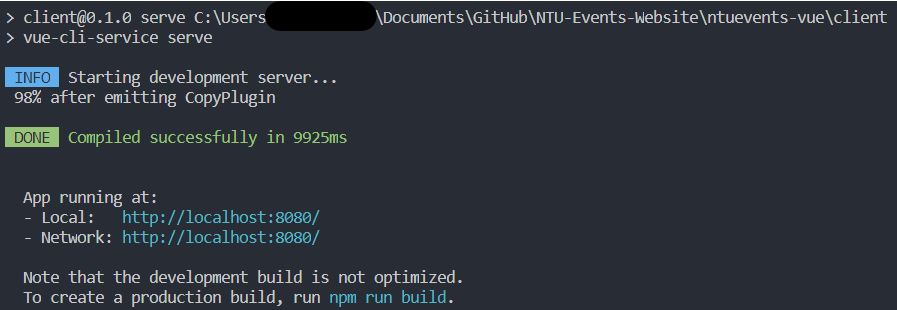

# Setup

## Installations

1. [MongoDB Community Server](https://www.mongodb.com/download-center/community)
2. [MongoDB Compass](https://www.mongodb.com/download-center/compass?jmp=hero)
3. [MongoDB Setup on Windows](https://leeweimin.com/install-mongodb-windows-10/)
4. [Official MongoDB Setup Guide](https://docs.mongodb.com/manual/installation/)
5. Vue Setup:
   `npm install -g @vue/cli`
6. Optional: [Visual Studio Code](https://code.visualstudio.com/Download) and [Github Desktop](https://desktop.github.com/)

## Running on Localhost

1. Clone [repository](https://github.com/NTUEvents/ntu-events)

2. Create .babelrc file in ntuevents-vue directory:

   ```
   {
      "presets": ["@babel/preset-env"]
   }
   ```

   

3. Change to ntuevents-vue directory:
   `cd ntuevents-vue`

4. At ntuevents-vue directory, run the following command in terminal:
   `npm install`

5. Change to client directory:
   `cd client`

6. Again, install dependencies:
   `npm install`

7. Start vue:
   `npm run serve`

   
